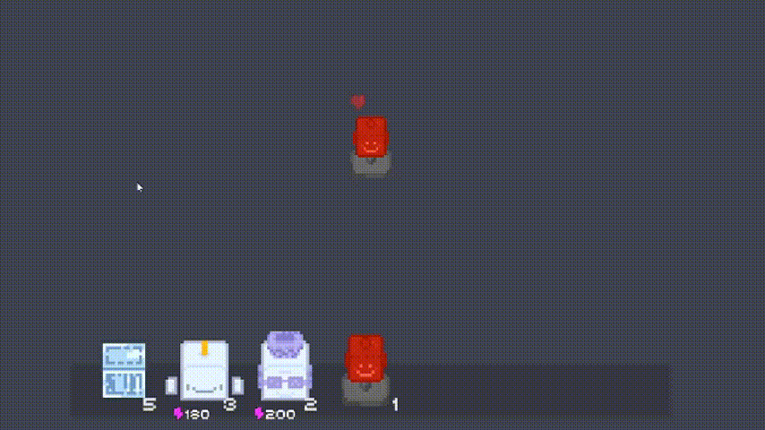
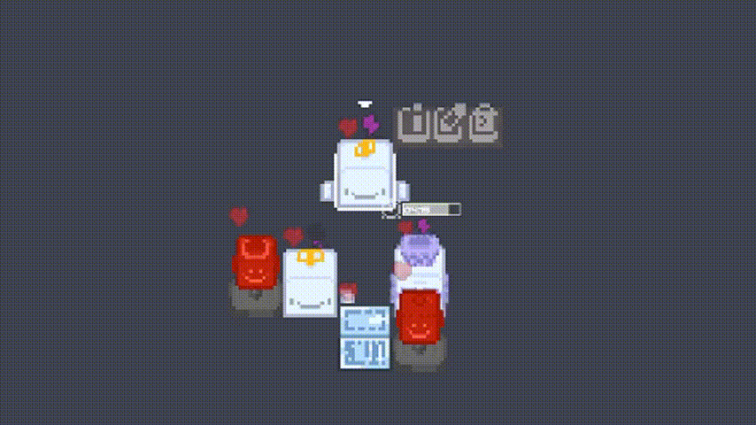
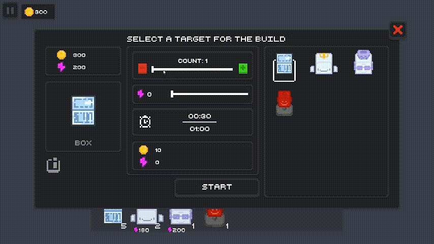

<div align="center">
    <h1>Takeover</h1>
</div>

<table style="margin-left: auto; margin-right: auto; width: 100%; border: none;">
<tr>
    <td style="text-align: left; vertical-align: middle; width: 70%; border: none;">
        <strong>Takeover</strong> — это стратегическая игра на раннем этапе разработки, где вы создаете и управляете армией ботов, чтобы захватить территорию, собирать ресурсы и сражаться с врагами. Стройте, планируйте и расширяйте свое влияние на сетке!
    </td>
</tr>
</table>

<div align="center">
    <i>Игра находится в активной разработке. Следите за обновлениями!</i>
</div>

<div align="left">
    <h1>Геймплей</h1>
</div>

- Создавайте различных ботов, каждый со своей уникальной функцией, и размещайте их на сетке;

<div align="center">
    <!-- Замените gameplay1.gif на ваш гифкой или скриншотом -->
    
</div>

- Расширяйте зону влияния, чтобы добраться до сундуков с наградами;
- Следите за здоровьем и энергией ботов для их полноценной работы;
- Редактируйте ботов прямо на поле с помощью окна редактирования.

- Захватывайте новые территории, открывайте сундуки с ресурсами и открывайте новые возможности.

<div align="center">
    <!-- Замените gameplay2.gif на ваш гифкой или скриншотом -->
    
</div>

- Объединяйте силы ваших ботов, чтобы дать отпор врагам и защитить свои владения.

<div align="center">
    <!-- Замените gameplay3.gif на ваш гифкой или скриншотом -->
    
</div>

<div align="center">⠀</div>

<div align="left">
    <h1>Арсенал ботов</h1>
</div>

На текущий момент в вашем распоряжении несколько типов ботов:

- **🤖 Проектировщик**: Тратьте монеты и энергию, чтобы бот производил других ботов.
- **🚚 Транспортер**:Может переносить других ботов из точки А в точку В.
- **⚡ Агрегатор**: Позволяет размещать новых ботов в радиусе вокруг себя, расширяя зону строительства.
- **📦 Коробка**: Простой бот-блок. Может использоваться как препятствие, ресурс или элемент стратегии.

*У ботов есть показатели здоровья и энергии. Все они имеют квадратную форму и размещаются на сетке.*

<div align="left">
    <h1>FAQ</h1>
</div>

#### Управление
- Управление осуществляется с помощью мыши: перетягивайте ботов из инвентаря на место постройки, а также взаимодействуйте с графическим интерфейсом.
- Собирайте предметы, такие как монеты и созданные боты также при помощи мыши.

#### Игровой процесс
Ваша цель — создавать и комбинировать ботов, чтобы захватить как можно большую территорию на карте. Используйте **Проектировщики** для создания армии, **Транспортеры** для создания сложных механизмов, а **Агрегаторы** — для расширения зоны влияния. Попутно сражайтесь с врагами и собирайте сундуки с ценными ресурсами.

#### Сохранение прогресса
В игре существует учтено сохранение прогресса и настроек.

---

<div align="left">
    <h1>Разработка и Установка</h1>
</div>

<div align="left">
Игра находится на раннем этапе разработки. Если вы хотите собрать проект локально:

1. Склонируйте репозиторий:
   ```bash
   git clone https://github.com/grandfrog0/Takeover.git
2. Откройте проект в Unity (рекомендуемая версия: 2022.3.55f1).
3. Проект готов к запуску.

</div><div align="left"> <h1>В планах на разработку</h1> </div>

- Добавление новых типов ботов (боевых, защитных, ресурсных);
- Разработка системы врагов;
- Создание процедурной генерации карты со структурами и сундуками;
- Полировка визуальной составляющей и UI.